# Analyze data with sparklyr

## Abstract

Sparklyr is an R package that lets you analyze data in Spark while using familiar tools in R. Sparklyr supports a complete backend for dplyr, a popular tool for working with data frame objects both in memory and out of memory. You can use dplyr to translate R code into Spark SQL. Sparklyr also supports MLlib so you can run classifiers, regressions, clustering, decision trees, and many more machine learning algorithms on your distributed data in Spark. With sparklyr you can analyze large amounts of data that would not traditionally fit into R memory. Then you can collect results from Spark into R for further visualization and documentation.

Sparklyr is also extensible. You can create R packages that depend on sparklyr to call the full Spark API. One example of an extension is H2O’s rsparkling, an R package that works with H2O’s machine learning algorithm. With sparklyr and rsparkling you have access to all the tools in H2O for analysis with R and Spark.

## Documents

* [Data Science Toolchain with Spark and R](http://colorado.rstudio.com:3939/content/276/taxiDemoH2O.nb.html)
* [Connecting to Spark through Livy](http://colorado.rstudio.com:3939/content/289/livy.nb.html)

## Slides

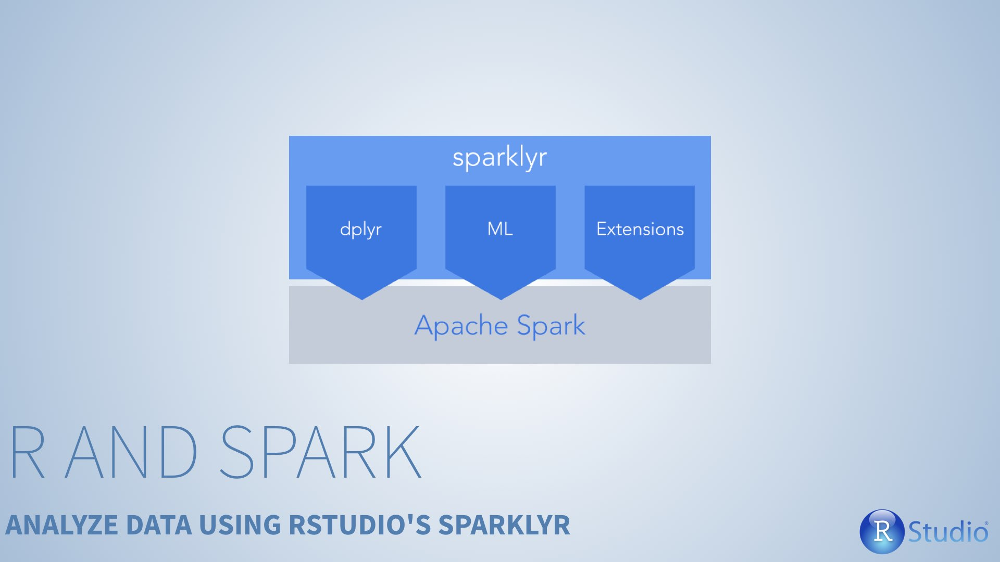

***

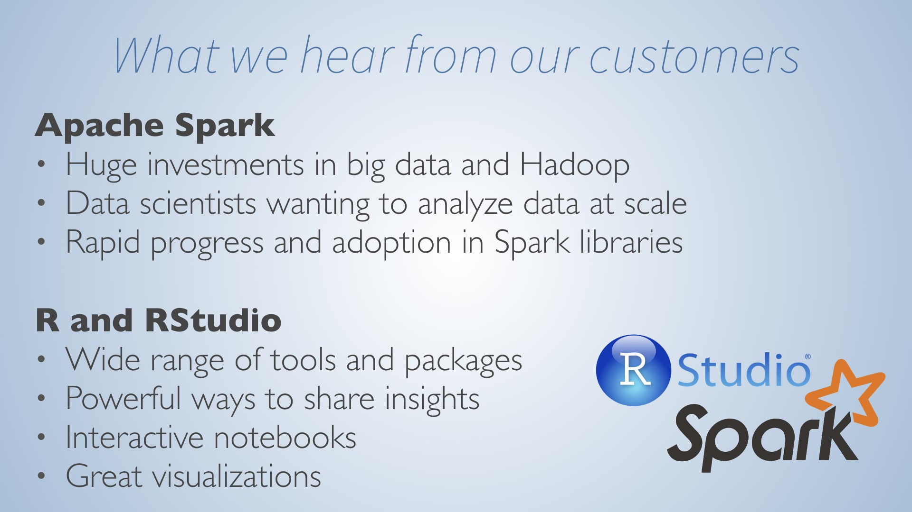

***

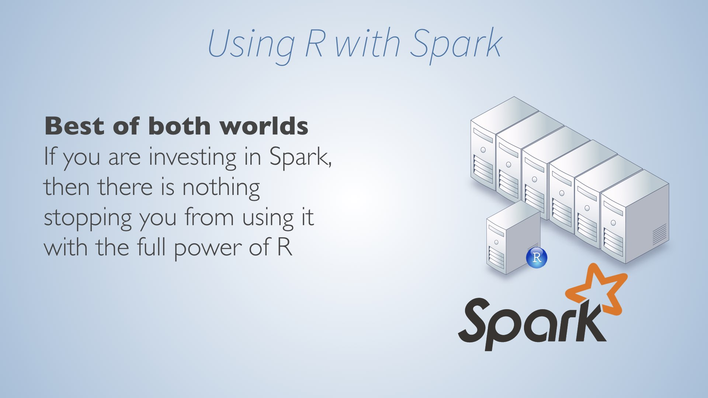

***

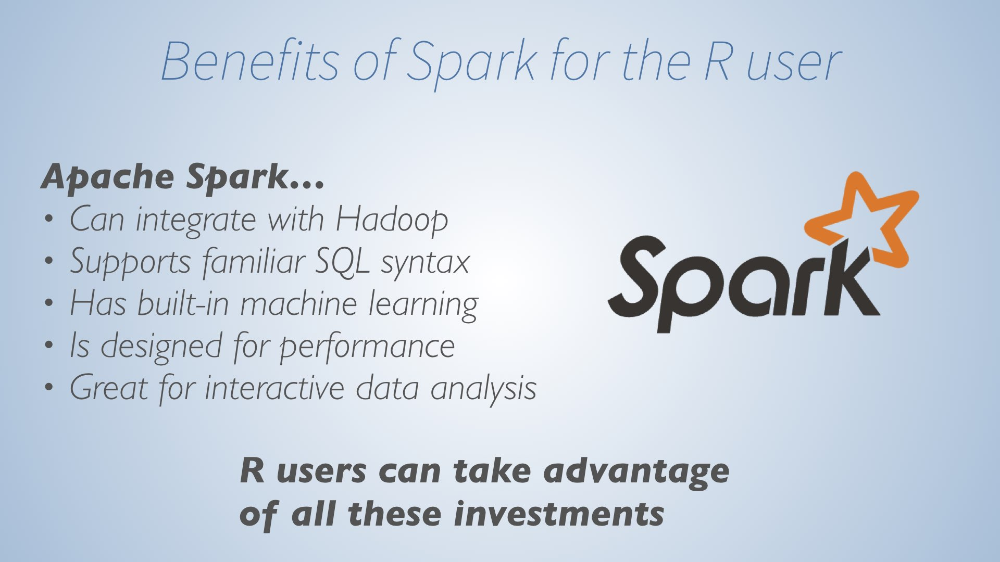

***

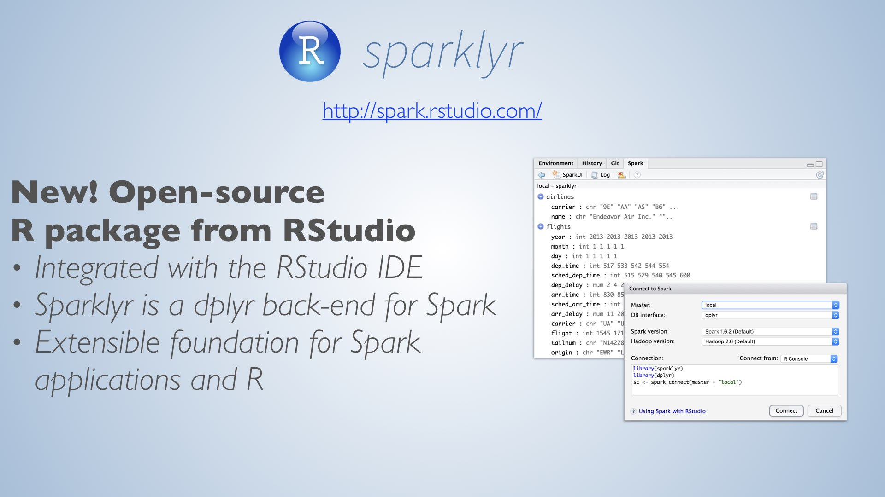

***

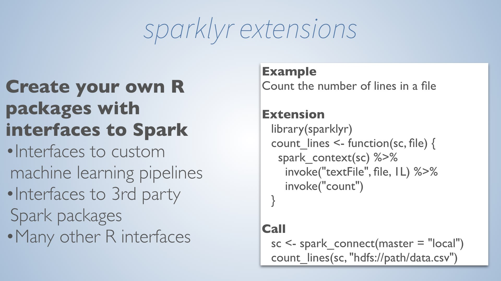

***

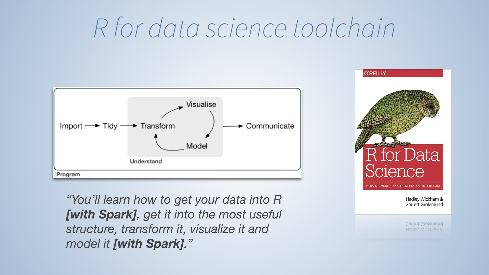

***

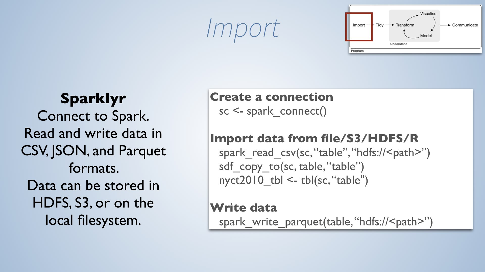

***

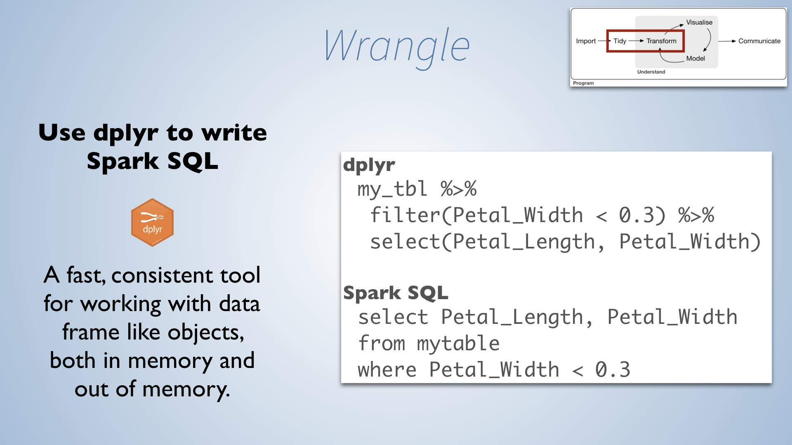

***

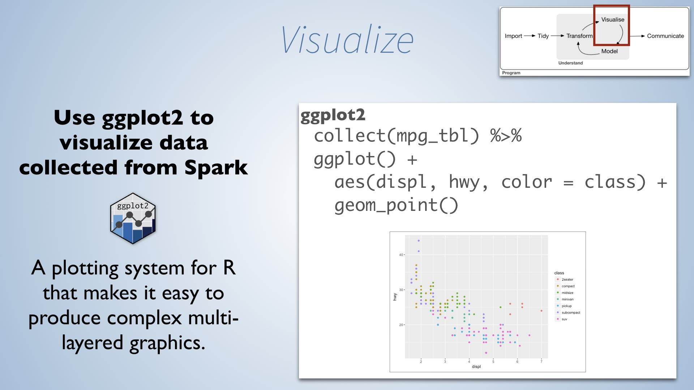

***

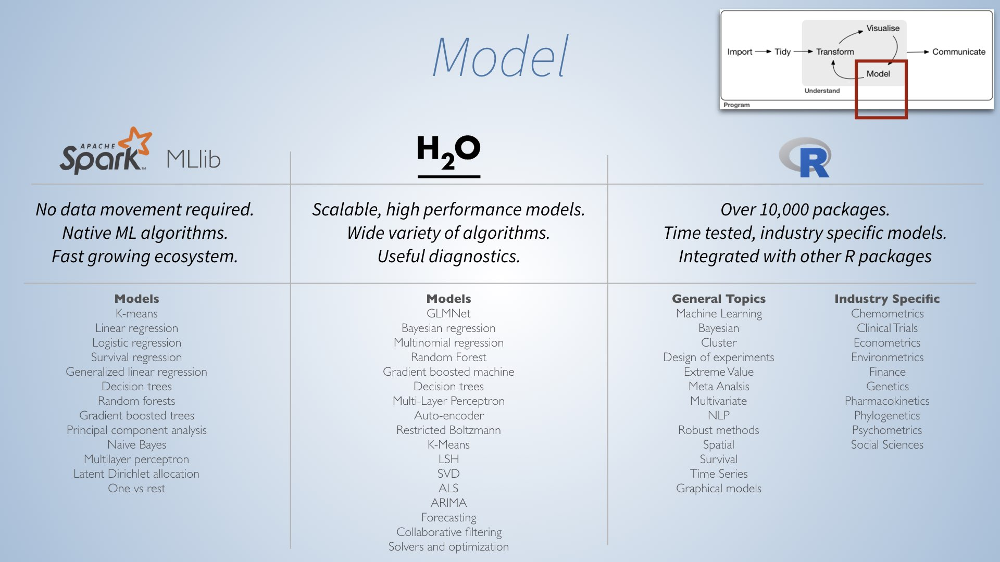

***

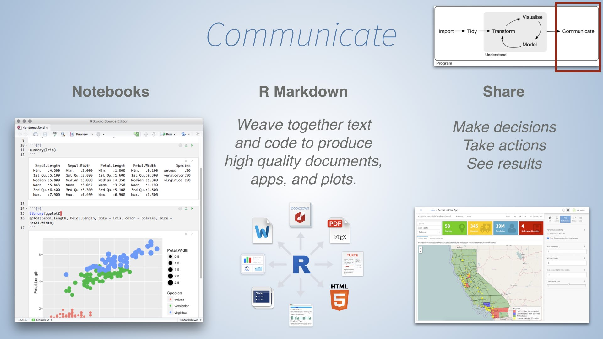

***

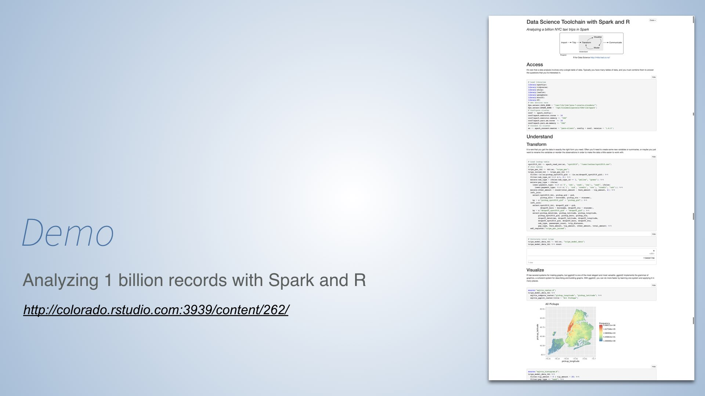

***

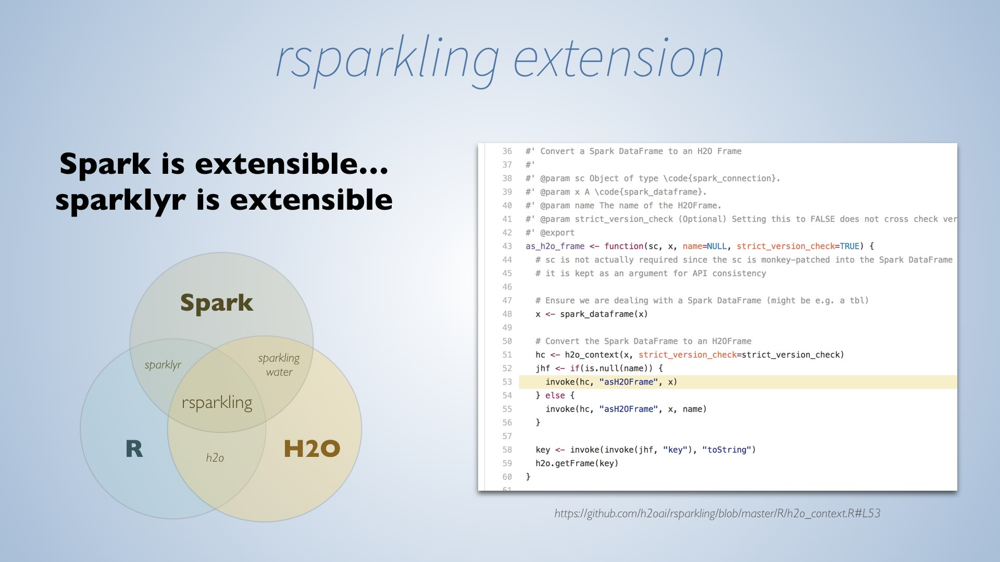

***

***

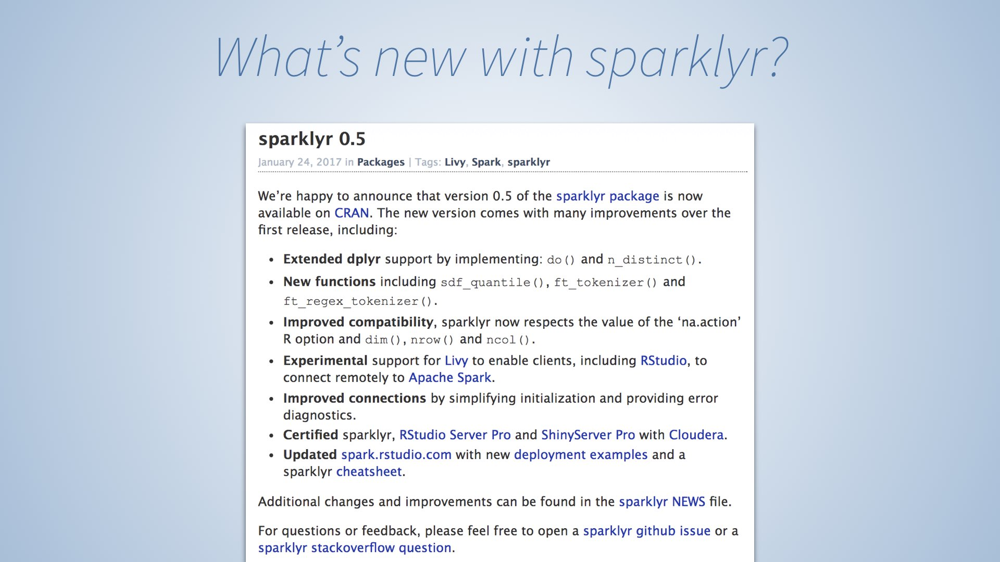

***

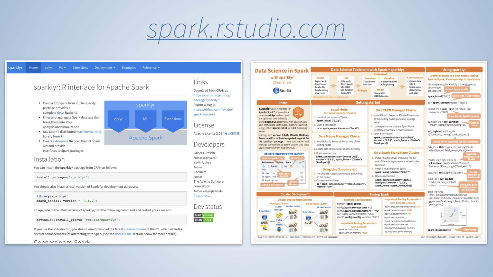
