# Analyze data with sparklyr

## Abstract

Sparklyr is an R package that lets you analyze data in Spark while using familiar tools in R. Sparklyr supports a complete backend for dplyr, a popular tool for working with data frame objects both in memory and out of memory. You can use dplyr to translate R code into Spark SQL. Sparklyr also supports MLlib so you can run classifiers, regressions, clustering, decision trees, and many more machine learning algorithms on your distributed data in Spark. With sparklyr you can analyze large amounts of data that would not traditionally fit into R memory. Then you can collect results from Spark into R for further visualization and documentation.

## Documents

* [Data Science Toolchain with Spark and R](http://colorado.rstudio.com:3939/content/420/taxiDemo.nb.html)
* [Tidyverse and R Notebooks with NYC Taxi Data](http://colorado.rstudio.com:3939/content/421/taxiDemo.nb.html)

## Slides

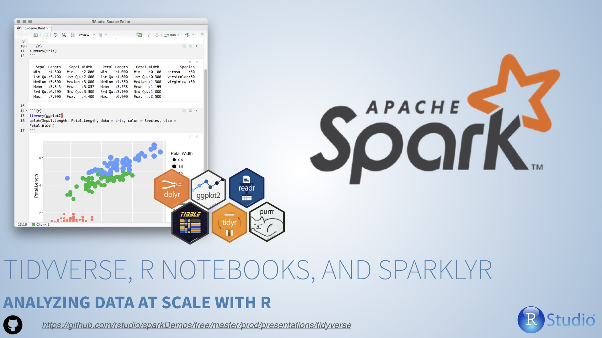

***

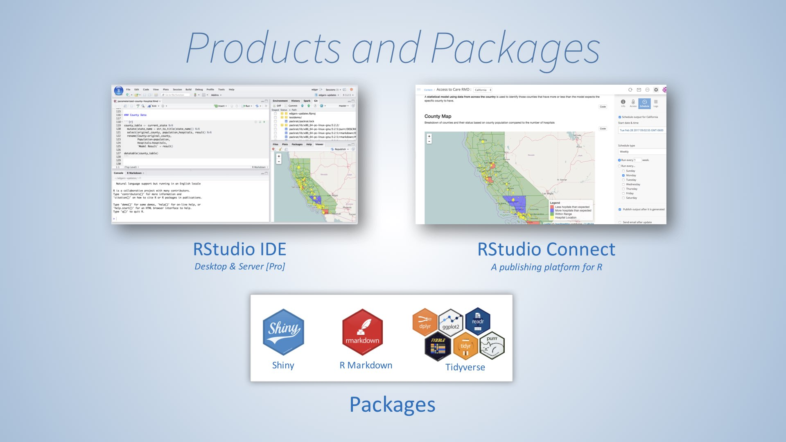

***

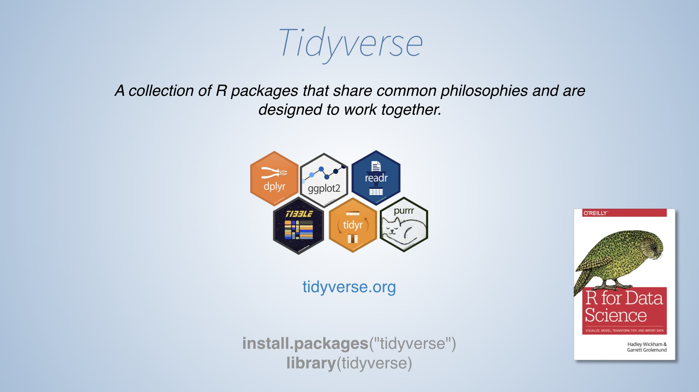

***

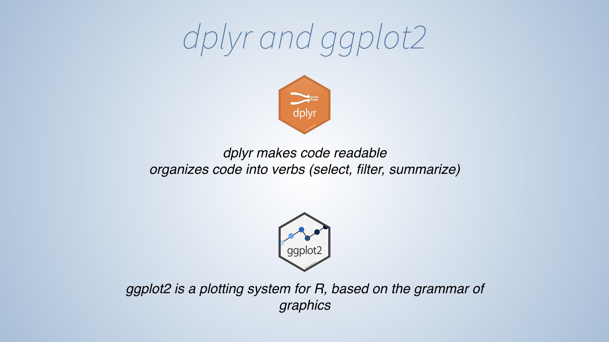

***

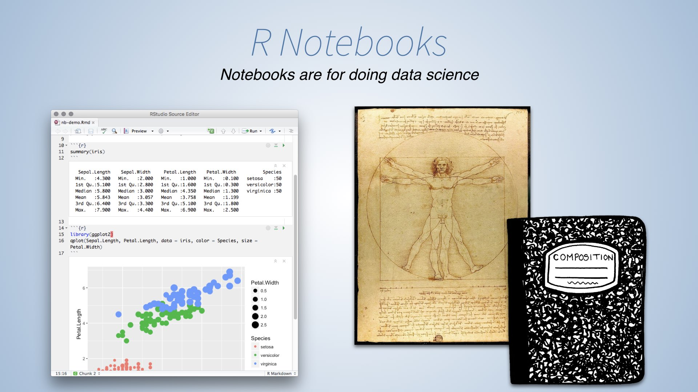

***

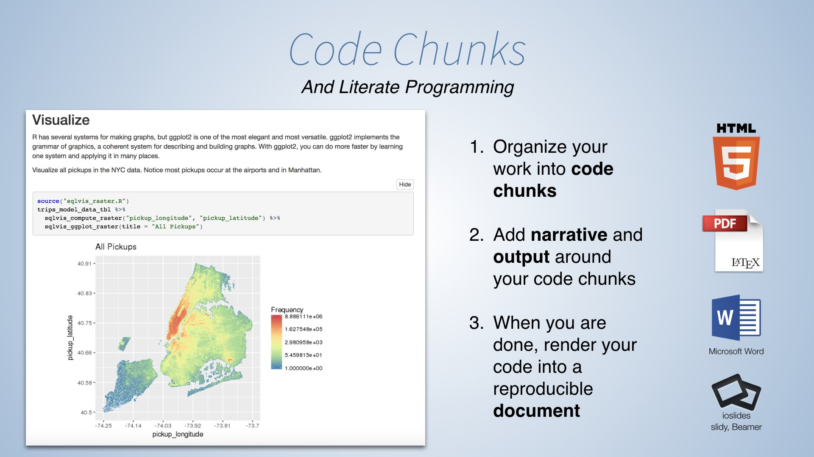

***

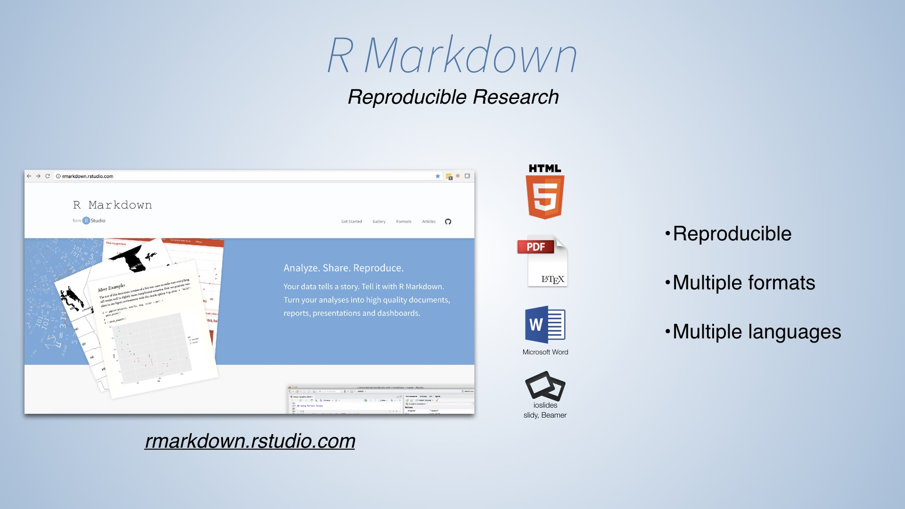

***

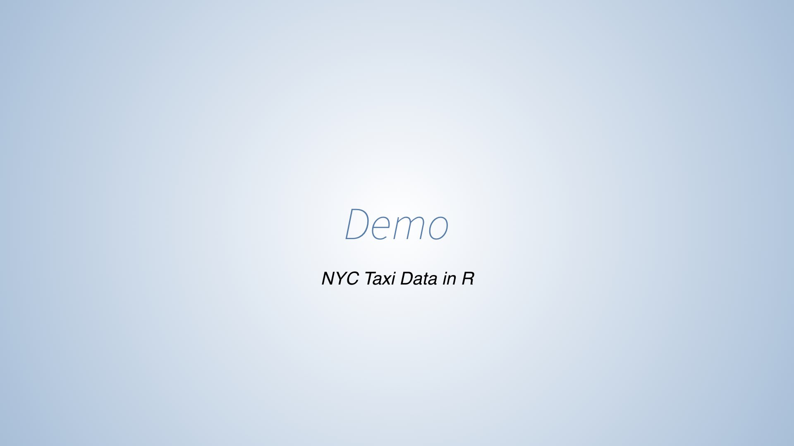

***

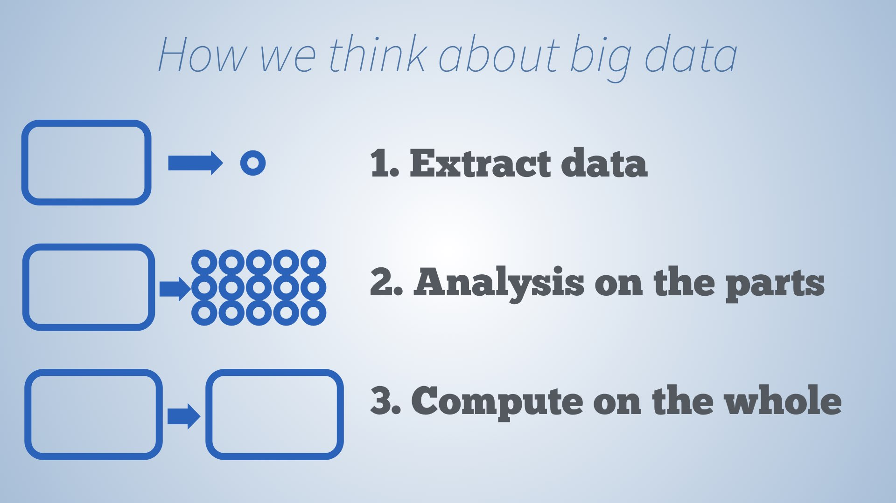

***

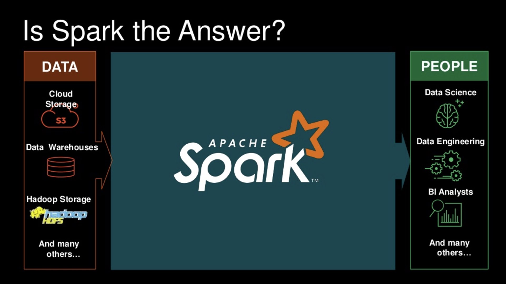

***

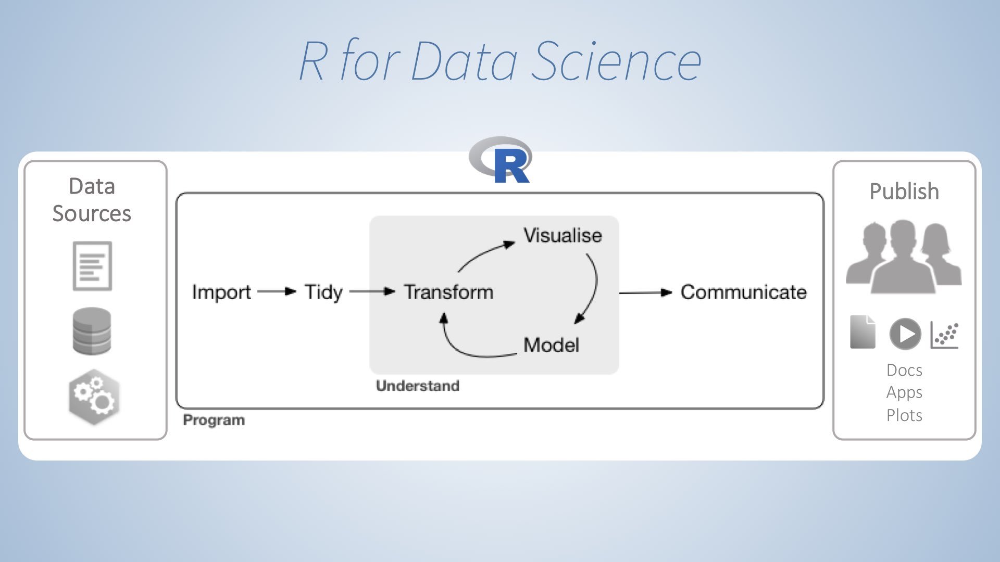

***

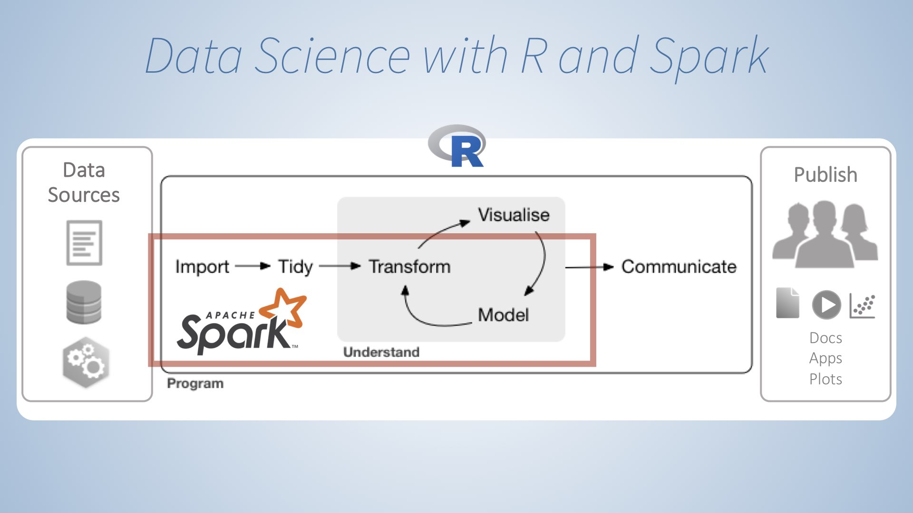

***

***

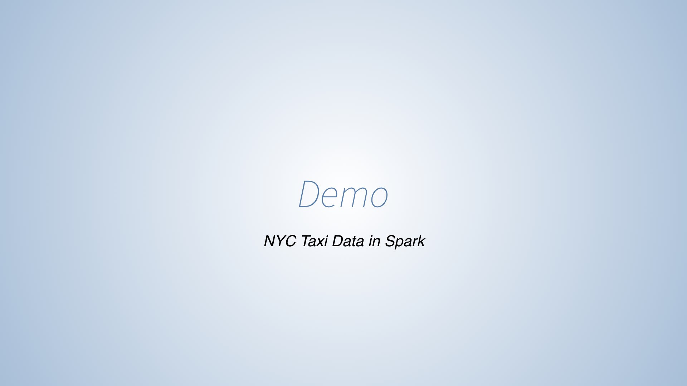

***

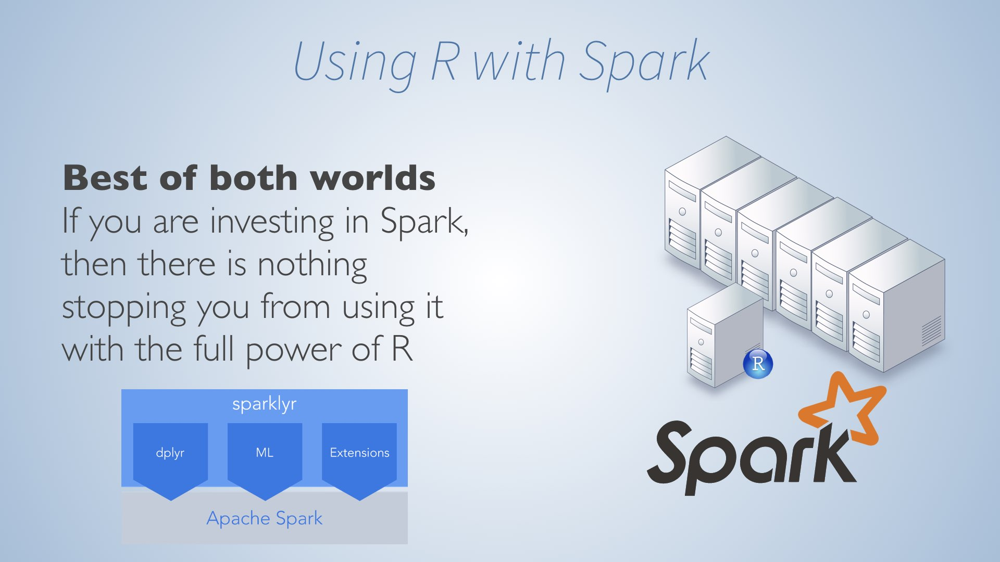

***

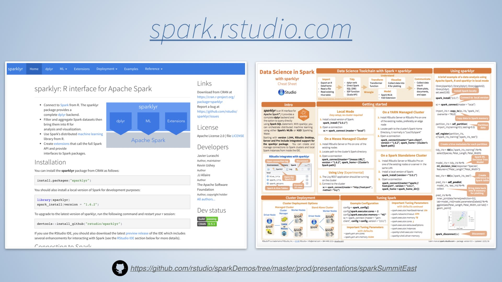

